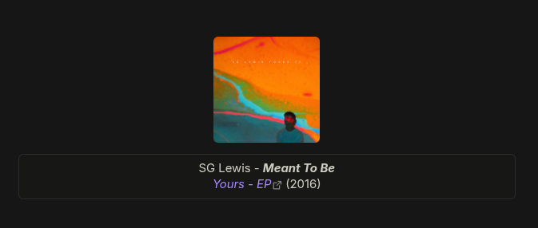

# Community Examples

Real-world templates shared by users. Each example includes the template snippet and a screenshot of the rendered output.

For the full variable reference, see [Templates](templates.md).

## Compact Card

A clean, compact display with album cover, artist, song, and release year.

**Template:**

```
{{ album_cover_medium|125x125 }}
#### {{ artists }} - <i>{{ song_name }}</i><br><sup><a href="{{ album_url }}"><i>{{ album }}</i></a> ({{ album_release|YYYY }})</sup>
```

**Result:**


*Contributed by [@amphyvi](https://github.com/amphyvi) in [#44](https://github.com/studiowebux/obsidian-spotify-link/issues/44)*

---

## Table Card

A centered table layout with cover image and track details. Works best with themes that use full-width tables without header borders (e.g. [Baseline](https://github.com/aaaaalexis/obsidian-baseline)).

**Template:**

```
| {{ album_cover_medium\|133x133 }} |
| :--: |
| {{ artists }} - ***{{ song_name }}***<br>*[{{ album }}]({{ album_url }})* ({{ album_release\|YYYY }}) |
```

Note the escaped pipe `\|` for image size and date format inside the table.

**Result:**



*Contributed by [@amphyvi](https://github.com/amphyvi) in [#44](https://github.com/studiowebux/obsidian-spotify-link/issues/44)*

---

## Share Your Template

Have a template you want to share? [Open an issue](https://github.com/studiowebux/obsidian-spotify-link/issues/new) with your template snippet and a screenshot of the result.
